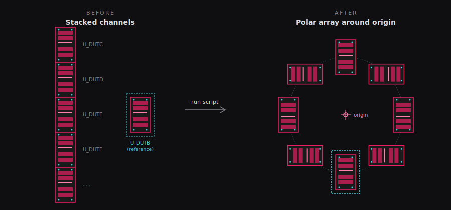
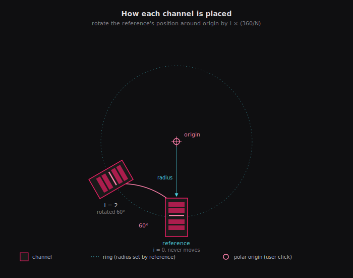
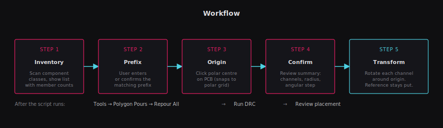

# Polar Channel Array

Altium DelphiScript that arranges multi-channel components into a circular pattern around a user-chosen origin.

## What it does

Takes a set of component classes that share a common prefix (e.g. `U_DUTB`, `U_DUTC`, `U_DUTD`...) and arranges them evenly around a polar origin. The first class alphabetically is the reference — it stays put. Before arranging, all other channels are automatically reset to match the reference channel's layout (position and rotation of every component). The channels are then rotated around the origin by `i × (360°/N)`.

Moves components, tracks, vias, arcs, fills, text, and free pads. Does not move polygons or room rectangles.

## Automatic reset

Before the polar array is applied, every non-reference channel is normalised to match the reference (first channel alphabetically, e.g. `U_DUTB`). Components are matched by their root designator — the designator with the channel class suffix stripped (e.g. `C1_U_DUTC` → `C1`). The matched component's X, Y, rotation, and layer are copied from the reference.

This guarantees a clean starting state on every run — whether it is the first run on freshly-stacked channels or a repeat run on an already-arranged board. Without this step, re-running the script would stack an additional rotation on top of the existing one.

**Note:** Free primitives (tracks, vias, fills) belonging to non-reference channels are not moved by the reset step. They are picked up by the polar arrangement step as long as they sit within the reference channel's component bounding box (expanded by a 25% margin, min 5 mm, max 50 mm).

## Usage

1. Lay out the reference channel (first alphabetically, e.g. `U_DUTB`) exactly where you want it on the ring.
2. Open the PCB. `File → Run Script… → Browse` → pick `PolarChannelArray.pas`.
3. Select `ArrangeChannelsInPolarArray` from the list.
4. Pick the prefix from the inventory dialog (auto-suggested).
5. Click the polar origin on the PCB (snaps to your Polar Grid if one is active), or type X/Y coordinates.
6. Review the summary — it shows channels, reference, radius, angular step, and confirms reset is enabled.
7. Click **Yes** to proceed.
8. `Tools → Polygon Pours → Repour All`, then run DRC.

## Requirements

- Altium Designer 20 or newer (tested on 25).
- A multi-channel design where component classes have been generated (should be automatic if you compiled from a multi-channel schematic).
- The first channel alphabetically must already be placed correctly — its position and orientation define the template for all other channels.

## Parameters

The script prompts for:

| Input | Description |
|---|---|
| Prefix | Common prefix of the channel classes (e.g. `U_DUT`) |
| Origin | Clicked on the PCB, or typed as X/Y in mm |

Radius and angular step are derived automatically from the reference channel's position and the number of matched channels.

## Limitations

- Polygons aren't transformed — repour after running.
- Room rectangles aren't moved — update manually via `Design → Rooms` if you use them.
- Dialog boxes may appear on a different monitor than Altium on multi-monitor setups. Click the Altium window before running to bias the first dialog.
- Undo works via `PCBServer.PreProcess/PostProcess`, but save the board first as a safety net.

## Files

- `PolarChannelArray.pas` — the script.
- `images/` — diagrams used in this README.

## Troubleshooting

**"No component classes found on this board"** — the schematic wasn't compiled with component class generation, or the board was created without multi-channel rooms. Run `Design → Update PCB Document` with class generation enabled.

**"Only 0 channel(s) matched prefix"** — the prefix doesn't match any class names. Check the inventory list shown in the first dialog for actual class names.

**Stragglers left behind after running** — free primitives (tracks, vias) that belonged to a channel but sat outside the channel's component bounding box. The script uses a 25% expanded bbox (min 5 mm, max 50 mm) to catch them. Increase `MARGIN_FRACTION` in the script constants if needed.

**Reference channel moved when it shouldn't have** — it shouldn't. The loop starts at `i := 1` and explicitly skips the reference. If this happens, report with before/after screenshots.

**Some components weren't reset** — the reset matches by root designator. If a component's designator doesn't follow the `<root>_<channel_class>` pattern, it won't be matched and will be skipped. Check designator naming in the schematic.
